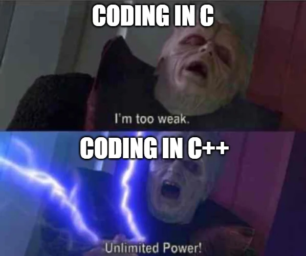
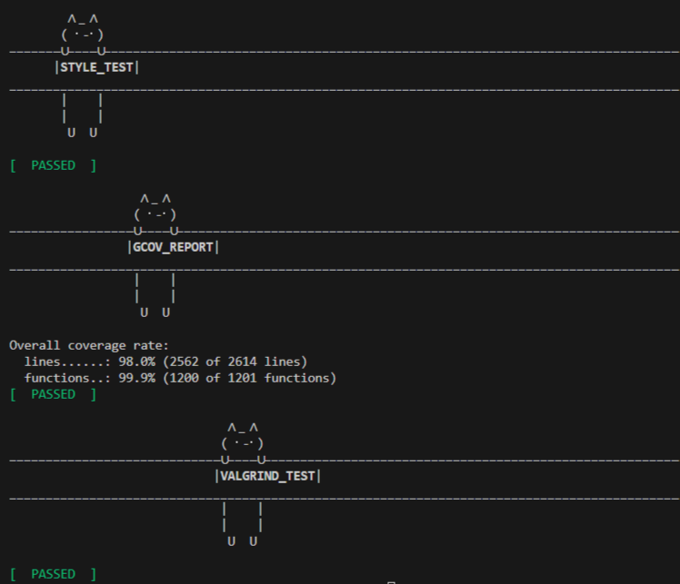

# s21_containers

Учебная C++17-библиотека STL-like контейнеров, реализованная с нуля в рамках School 21. Проект показывает работу с шаблонами, итераторами, управлением памятью, красно-черным деревом, unit-тестами и CI-проверками.

## Что реализовано

| Контейнер | Реализация | Что проверяется |
| --- | --- | --- |
| `s21::vector` | динамический массив | доступ по индексу, capacity, insert/erase, итераторы |
| `s21::list` | двусвязный список | вставка/удаление, splice/merge/sort, двунаправленные итераторы |
| `s21::map` | ассоциативный контейнер на красно-черном дереве | вставка, поиск, доступ по ключу, балансировка |
| `s21::set` | множество на красно-черном дереве | уникальность ключей, поиск, insert/erase |
| `s21::stack` | LIFO-адаптер | push/pop/top, размер, пустое состояние |
| `s21::queue` | FIFO-адаптер | push/pop/front/back, размер, пустое состояние |

Код живет в `src/`, публичная точка подключения - [`src/s21_containers.h`](src/s21_containers.h).

## Быстрый запуск

```bash
cd src
make build
make test
```

Полный локальный quality gate:

```bash
cd src
make style-check
make gcov_report
make valgrind
```

## Проверки качества

- `GTest` покрывает поведение контейнеров и итераторов.
- `clang-format` проверяет стиль по Google Style.
- `gcov_report` собирает покрытие и падает, если lines/functions coverage ниже 85%.
- `valgrind` проверяет утечки и ошибки работы с памятью.
- GitHub Actions запускает build, style-check, unit tests, coverage report и Valgrind.

## Структура проекта

```text
src/
  s21_containers.h        единая точка подключения
  vector/s21_vector.h     динамический массив
  list/s21_list.h         двусвязный список
  map/s21_map.h           map API
  set/s21_set.h           set API
  rb-tree/s21_tree.h      красно-черное дерево для map/set
  stack/s21_stack.h       stack adapter
  queue/s21_queue.h       queue adapter
  unit_tests/             GTest-набор
  Makefile                build/test/coverage/valgrind/style targets
```

## Инженерный фокус

- Не копировать STL-реализации, а воспроизвести контракт контейнеров через собственные структуры данных.
- Держать API близким к стандартным контейнерам C++, чтобы тесты можно было сопоставлять с ожидаемым STL-поведением.
- Проверять не только happy path, но и граничные случаи: пустые контейнеры, iterator boundary, erase/insert, copy/move behavior.
- Для `map` и `set` использовать сбалансированное дерево, а не линейный поиск.
- Собирать проект одной командой и держать CI как обязательный safety net.

## Ограничения

Это учебная библиотека, а не production-замена STL. Она полезна как демонстрация алгоритмов, структуры памяти и дисциплины тестирования, но в прикладных C++ сервисах стандартная библиотека остается предпочтительным выбором.

## Исторический контекст

Групповой проект из School 21 был сделан как упражнение по низкоуровневому C++ после C-интенсива. Ниже оставлен исходный более неформальный тон проекта как часть учебной истории.



### Контейнеры простыми словами

Контейнеры - это структуры, в которых программа хранит данные и выбирает компромисс между скоростью доступа, вставкой, удалением и упорядочиванием.

- **List**: двусвязный список для быстрых вставок и удалений при известной позиции.
- **Map**: пары `ключ-значение`, где поиск и вставка работают через дерево.
- **Queue**: очередь FIFO, где первым выходит элемент, добавленный раньше остальных.
- **Set**: множество уникальных ключей.
- **Stack**: стек LIFO, где первым выходит последний добавленный элемент.
- **Vector**: динамический массив с быстрым доступом по индексу.


### Итераторы

Итераторы позволяют обходить контейнеры и работать с элементами без знания внутренней структуры хранения.

Поддерживаемые операции:

- `*iter`: получить элемент, на который указывает итератор;
- `++iter`: перейти к следующему элементу;
- `--iter`: вернуться к предыдущему элементу;
- `iter1 == iter2`: проверить, что итераторы указывают на одну позицию;
- `iter1 != iter2`: проверить, что итераторы указывают на разные позиции.

### Красно-черное дерево

`map` и `set` используют общую реализацию красно-черного дерева в [`src/rb-tree/s21_tree.h`](src/rb-tree/s21_tree.h). Дерево поддерживает балансировку при вставке и удалении, чтобы операции поиска и обновления не деградировали до линейного обхода.

```cpp
template <class K, class Compare = std::less<K>>
class RBTree {
 public:
  using key_type = K;
  using tree_node = s21::Node<key_type>;
  using iterator = s21::Iterator<key_type>;

  RBTree() : head_(new tree_node), size_(0){};
  ~RBTree();

  iterator TreeBegin() noexcept;
  iterator TreeEnd() noexcept;
  std::pair<iterator, bool> Insert(const key_type &key);
  void TreeClear();
};
```

### Makefile targets

| Target | Назначение |
| --- | --- |
| `make build` | собрать `s21_containers.a` |
| `make test` | собрать и запустить GTest |
| `make style-check` | проверить форматирование |
| `make gcov_report` | собрать HTML-отчет покрытия |
| `make valgrind` | проверить runtime через Valgrind |
| `make clean` | удалить временные артефакты |


